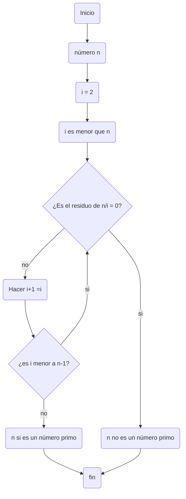

# Reto-3
## Pseudocódigo y Diagramas de flujo
Este reto consiste en utilizar los metodos de Pseudocódigo y de Diagramas de Flujo para demostrar dos diferentes problematicas de naturaleza matemática las cuales son: ¿es n un número primo? y ¿a n se le puede aplicar la raíz cuadrada?, n siendo un número entero cualquiera.

## Números Primos
### Pseudocódigo 1
Antes que nada quiero aclarar que el pseudocódico es un tipo de lenguaje más que nada casual y no tan riguroso en la programación. Se usa principalmente para generar una planeación de un códico cualquiera y que sea fácil de entender.

Para iniciar un pseudocódigo se coloca en una fila tres "acentos graves" (`) y eso seguido de la palabra "pseudocode", y para cerrar se pasa a una fila distinta y se colocan únicamente otros tres "acentos graves".

Ahora si voy a pasar a la parte de definir el pseudocódico de ¿cómo saber si un número cualuqiera n es un primo?

```pseudocode
  [Variables]
n:entero
i:entero

  [A calcular]
Inicio
Para i:= 2 Hasta n hacer
  Mientras (i<n) Entonces
    Si modulo(n,i) == 0 Entonces
      Escribir("n no es un número primo")
    Sino
      si modulo (n,i) > 0 Entonces
        Escribir ("n si es un número primo")
  Fin Mientras
Fin
```
### Diagrama de flujo 1
Los diagramas son una representación más gráfica de lo que explica el pseudocódico, además se crean de una forma similar a estos: lo que se hace es colocar las mismas especificaciones de los tres "acentos graves" al inicio y al final y lo único diferente que toca hacer es cambiar "pseudocode" por un "mermaid".



## Raices cuadradas
### pseudocódigo 2


### Diagrama de flujo 2
